---
## Front matter
lang: ru-RU
title: Модель гармонических колебаний
subtitle: Лабораторная работа №4
author:
  - Покрас Илья Михайлович 
institute:
  - Российский университет дружбы народов, Москва, Россия
date: 2 марта 2023

## i18n babel
babel-lang: russian
babel-otherlangs: english

## Formatting pdf
toc: false
toc-title: Содержание
slide_level: 2
aspectratio: 169
section-titles: true
theme: metropolis
header-includes:
 - \metroset{progressbar=frametitle,sectionpage=progressbar,numbering=fraction}
 - '\makeatletter'
 - '\beamer@ignorenonframefalse'
 - '\makeatother'
---

## Цели и задачи
Целью данной лабораторной работы является построение математических моделей гармонический колебаний.

## Задачи
Построить фазовый портрет гармонического осциллятора и решенить уравнения гармонического осциллятора для следующих случаев:
1. Колебания гармонического осциллятора без затуханий и без действий внешней силы
2. Колебания гармонического осциллятора c затуханием и без действий внешней
силы
3. Колебания гармонического осциллятора c затуханием и под действием внешней силы

## Ход Работы
Код Julia:

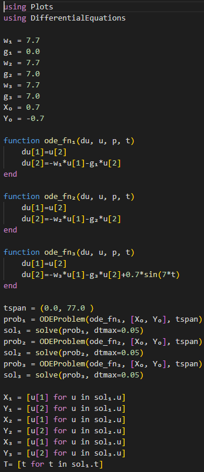{#fig:001 height=85%}
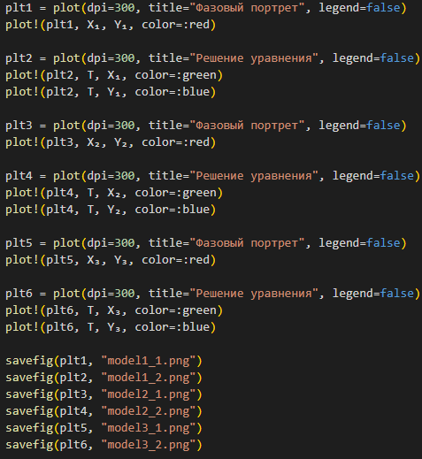{#fig:002 height=75%}

## Ход Работы
Первый случай: 

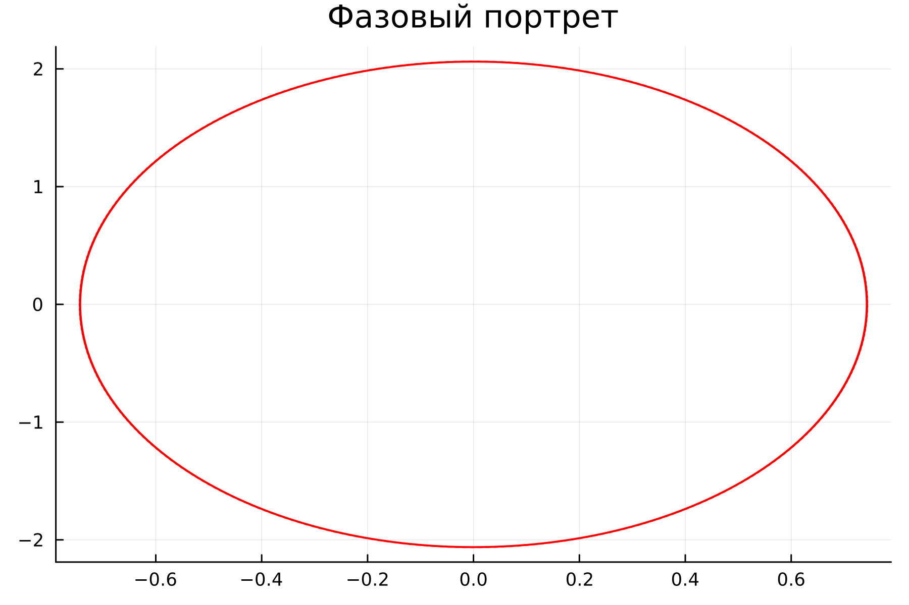{#fig:003 height=50%}
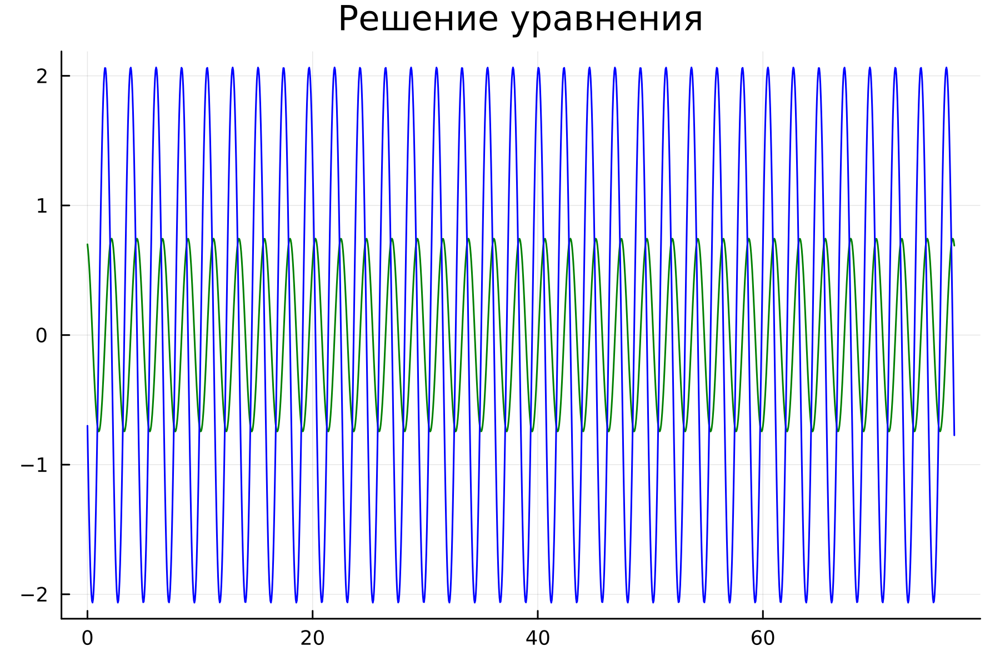{#fig:004 height=50%}

## Ход Работы
Второй случай: 

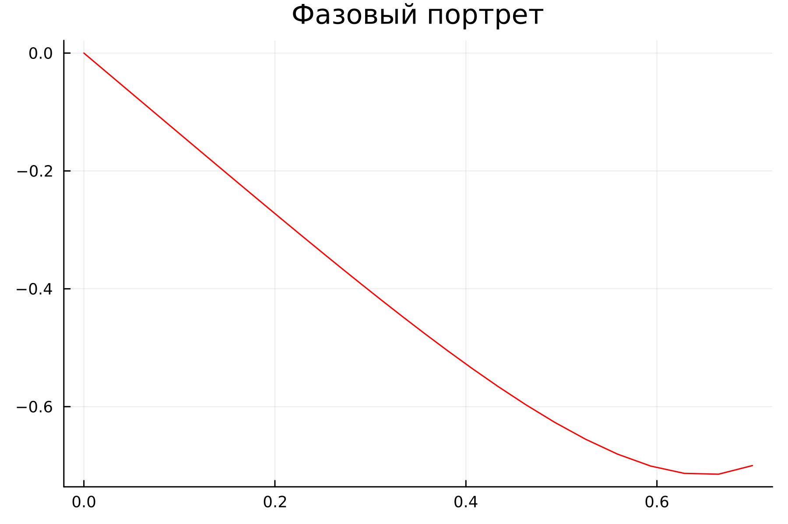{#fig:004 height=50%}
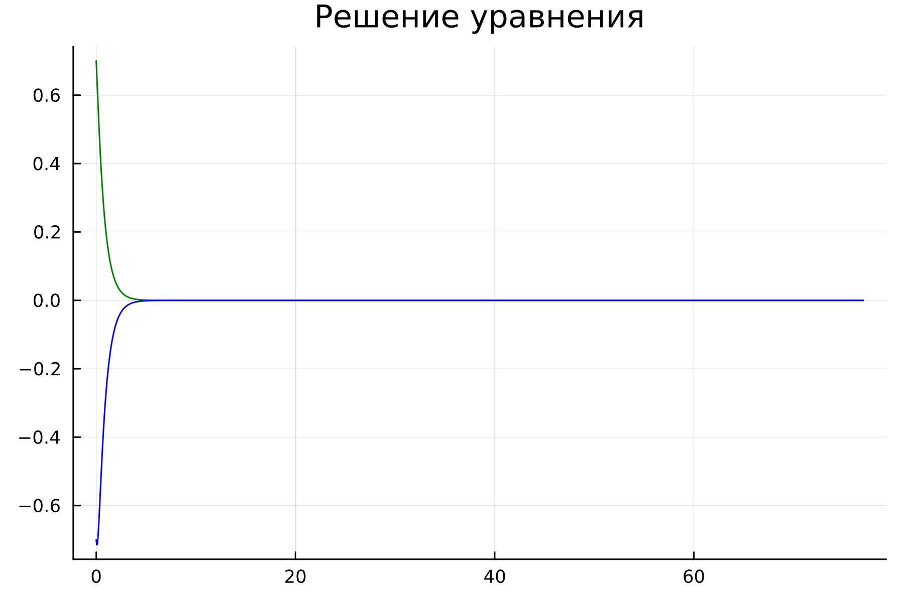{#fig:005 height=50%}

## Ход Работы
Третий случай: 

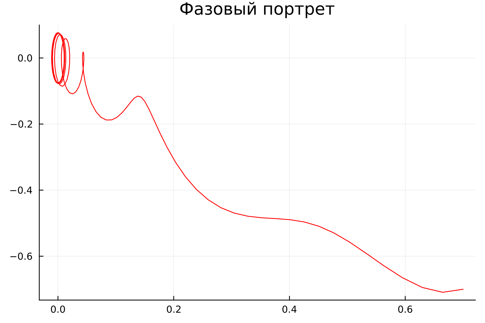{#fig:006 height=50%} 
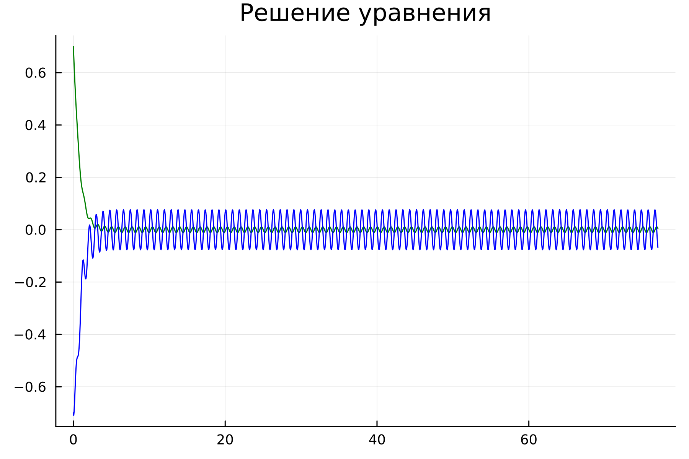{#fig:007 height=50%}

## Ход Работы
Код OpenModelica:

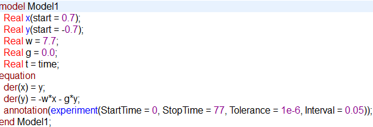{#fig:008 height=50%}

## Ход Работы

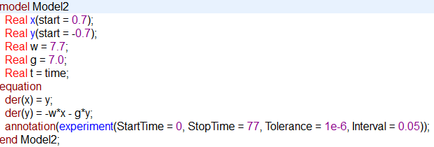{#fig:009 height=50%}

## Ход Работы

{#fig:010 height=50%}

## Ход Работы
Первый случай:

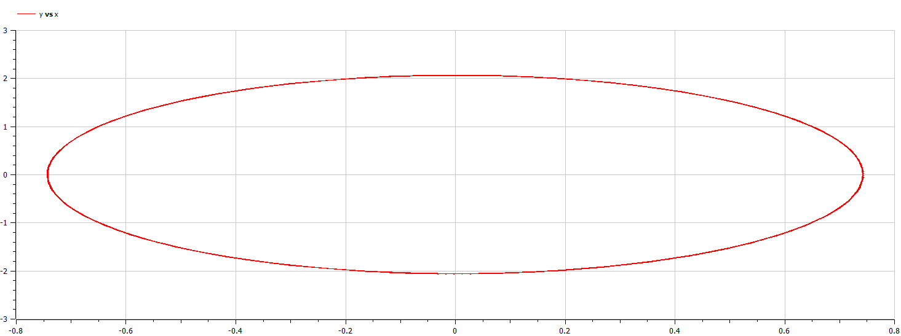{#fig:011 height=30%}
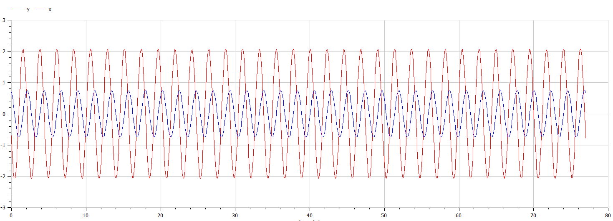{#fig:012 height=30%}

## Ход Работы
Второй случай: 

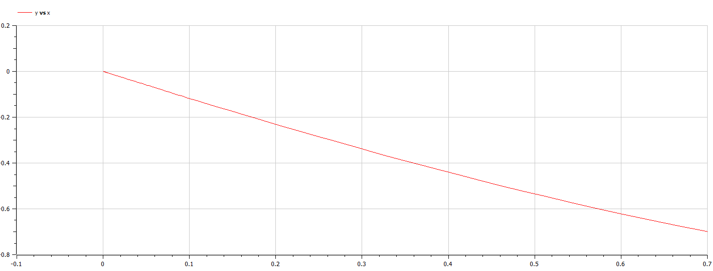{#fig:013 height=30%}
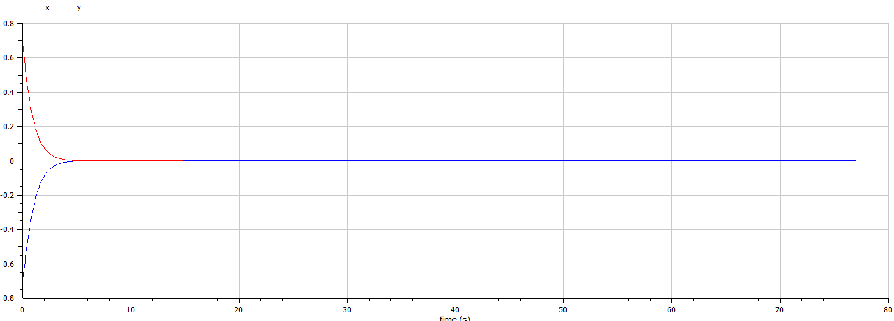{#fig:014 height=30%}

## Ход Работы
Третий случай:

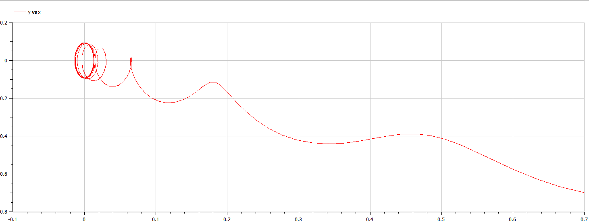{#fig:015 height=30%}
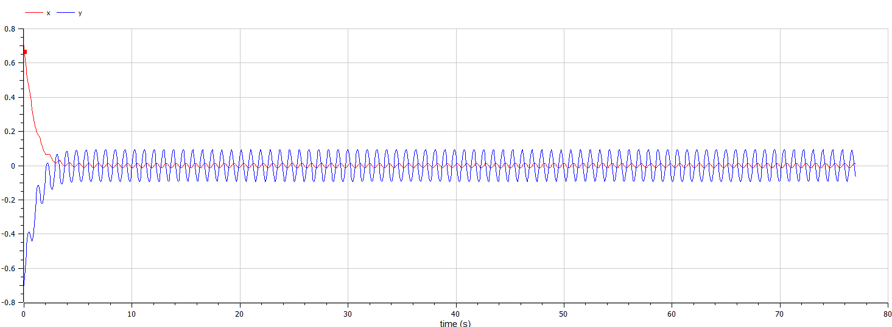{#fig:016 height=30%}

## Результаты

В резльтате проделанной работы был написан код на Julia и OpenModelica для решения 3 случаев движения гармонического осциллятора.