---
## Front matter
title: "Лабораторная работа № 3"
subtitle: "Модель гармонический колебаний"
author: "Покрас Илья Михайлович"

## Generic otions
lang: ru-RU
toc-title: "Содержание"

## Bibliography
bibliography: bib/cite.bib
csl: pandoc/csl/gost-r-7-0-5-2008-numeric.csl

## Pdf output format
toc: true # Table of contents
toc-depth: 2
lof: true # List of figures
lot: false
fontsize: 12pt
linestretch: 1.5
papersize: a4
documentclass: scrreprt
## I18n polyglossia
polyglossia-lang:
  name: russian
  options:
	- spelling=modern
	- babelshorthands=true
polyglossia-otherlangs:
  name: english
## I18n babel
babel-lang: russian
babel-otherlangs: english
## Fonts
mainfont: PT Serif
romanfont: PT Serif
sansfont: PT Sans
monofont: PT Mono
mainfontoptions: Ligatures=TeX
romanfontoptions: Ligatures=TeX
sansfontoptions: Ligatures=TeX,Scale=MatchLowercase
monofontoptions: Scale=MatchLowercase,Scale=0.9
## Biblatex
biblatex: true
biblio-style: "gost-numeric"
biblatexoptions:
  - parentracker=true
  - backend=biber
  - hyperref=auto
  - language=auto
  - autolang=other*
  - citestyle=gost-numeric
## Pandoc-crossref LaTeX customization
figureTitle: "Рис."
tableTitle: "Таблица"
listingTitle: "Листинг"
lofTitle: "Список иллюстраций"
lotTitle: "Список таблиц"
lolTitle: "Листинги"
## Misc options
indent: true
header-includes:
  - \usepackage{indentfirst}
  - \usepackage{float} # keep figures where there are in the text
  - \floatplacement{figure}{H} # keep figures where there are in the text
---

# Цели работы

Целью данной лабораторной работы является построение математической модели гармонический колебаний.

# Задание

Построим фазовый портрет гармонического осциллятора и решение уравнения гармонического осциллятора для следующих случаев:

1. Колебания гармонического осциллятора без затуханий и без действий внешней cил:
$\ddot{x} + 7.7x = 0$
2. Колебания гармонического осциллятора c затуханием и без действий внешней силы:
$\ddot{x} + 7\dot{x} + 7.7x = 0$
3. Колебания гармонического осциллятора c затуханием и под действием внешней силы:
$\ddot{x} + 7\dot{x} + 7.7x = 0.7sin(7t)$

# Теоретическое введение:

Движение грузика на пружинке, маятника, заряда в электрическом контуре, а также эволюция во времени многих систем в физике, химии, биологии и других науках при определенных предположениях можно описать одним и тем же дифференциальным уравнением, которое в теории колебаний выступает в качестве основной модели. Эта модель называется линейным гармоническим осциллятором. Уравнение свободных колебаний гармонического осциллятора имеет следующий вид:

$\ddot{x} + 2\gamma\dot{x} + \omega_{0}^2x = 0$

где x – переменная, описывающая состояние системы (смещение грузика, заряд конденсатора и т.д.), $\gamma$ – параметр, характеризующий потери энергии (трение в механической системе, сопротивление в контуре),  $\omega_{0}$ – собственная частота колебаний, $t$ – время.

# Выполнение лабораторной работы

## Код на Julia:

Инициализируем библиотеки для дальнейшей дальнейшей работы. Далее
создадим переменные для начальных X и Y и опишем $\omega$ и $\gamma$ для 3 случаев (@fig:001).

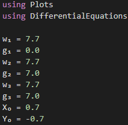{#fig:001}

Создаим с помощью Differential Equations системы уравнений для 3 случаев(@fig:002).

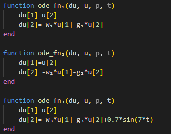{#fig:002}

С помощью solve получим решения ОДУ для всех случаев(@fig:003).

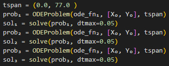{#fig:003}

Сохраним данные решений в отдельные вектора для каждого случая (@fig:004).

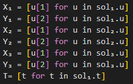{#fig:004}

Визуализируем решение с помощью Plots(@fig:005)

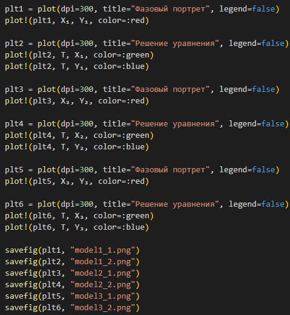{#fig:005}

Математические модели для первого случая(@fig:006 - @fig:007)

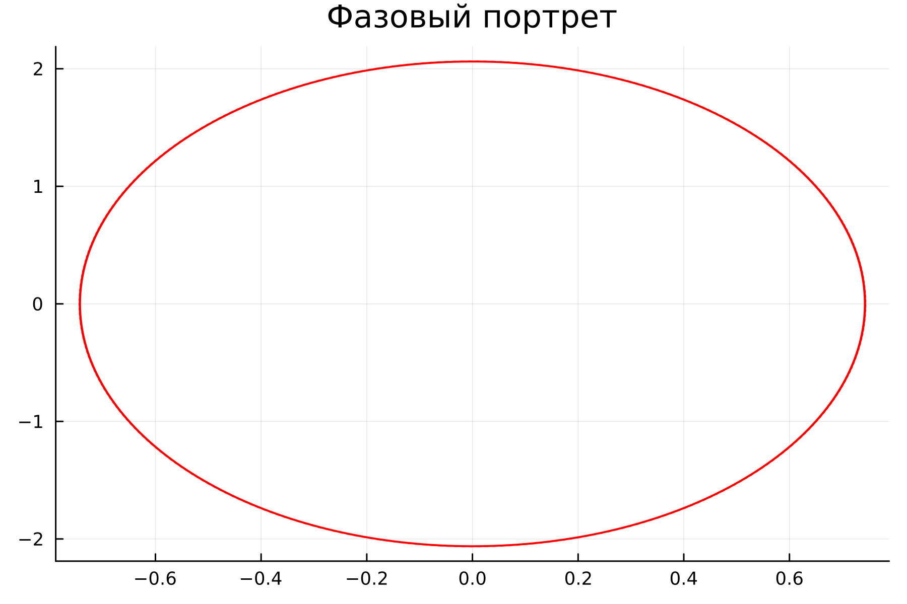{#fig:006}

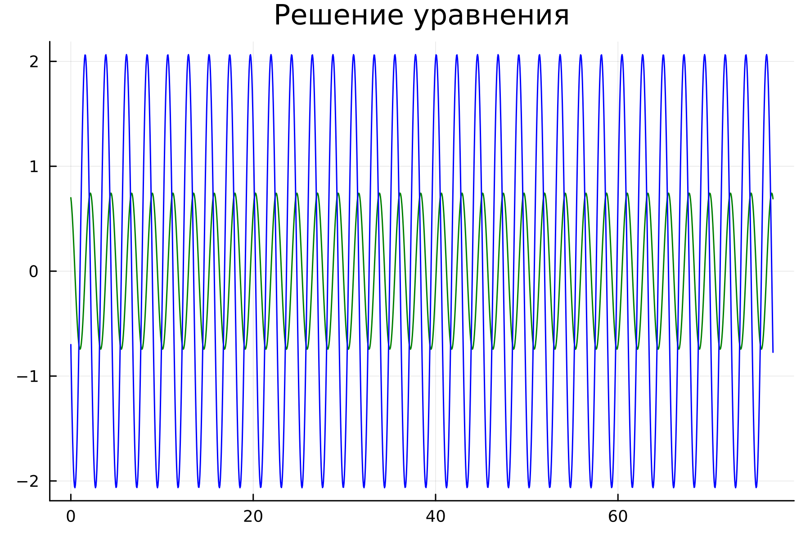{#fig:007}

Математические модели для второго случая(@fig:008 - @fig:009)

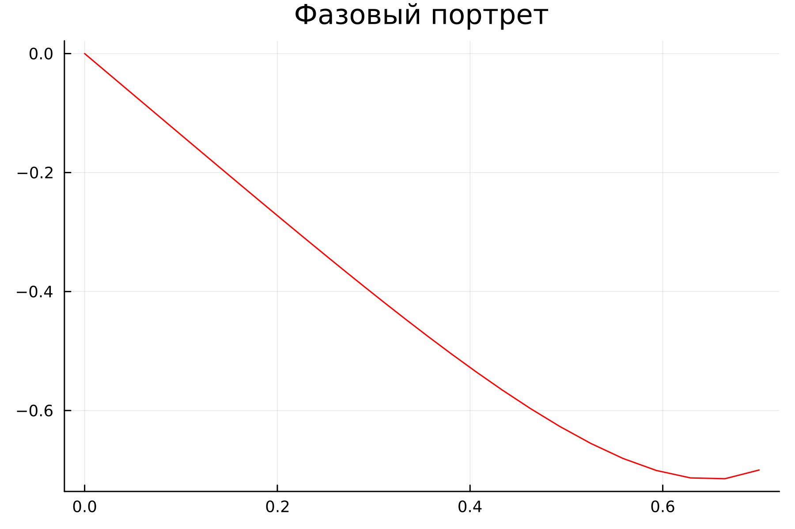{#fig:008}

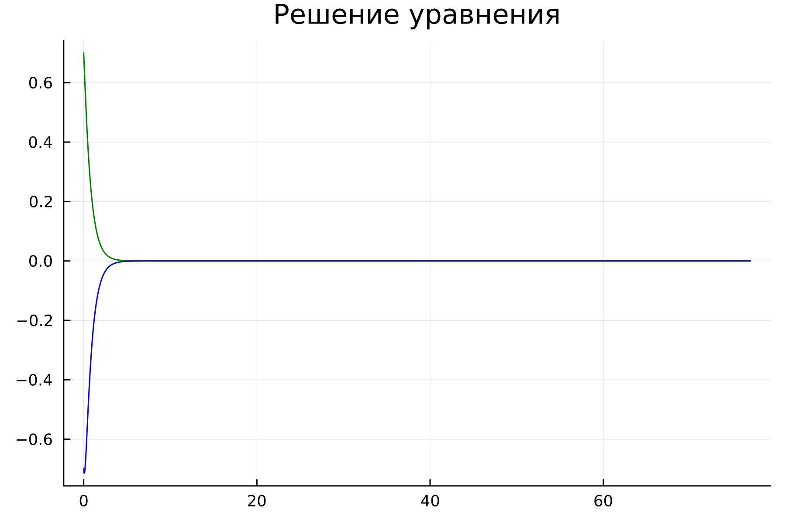{#fig:009}

Математические модели для третьего случая(@fig:008 - @fig:009)

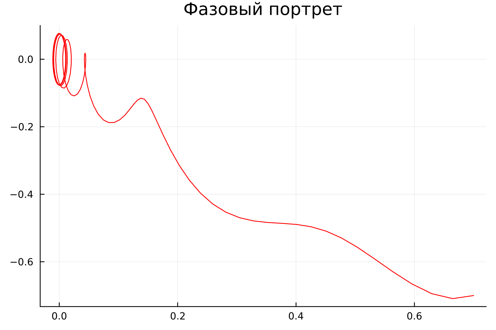{#fig:010}

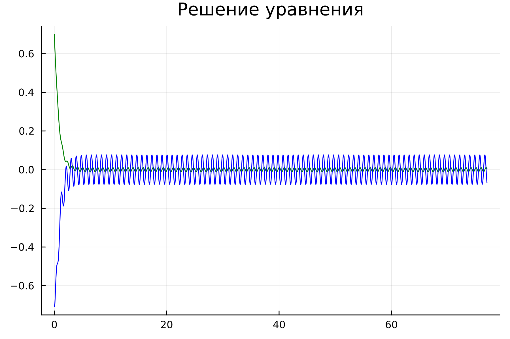{#fig:011}

## Код OpenModelica:

Сначала создадимX и Y, указав значений нулевых как стартовые, после чего опишем $\omega$ и $\gamma$. Далее запишем дифференциальное уравнение (@fig:012 - @fig:014).

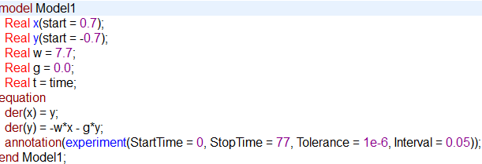{#fig:012}

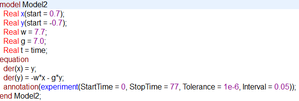{#fig:013}

{#fig:014}

Визуализируем фазовые портреты и решения на графике для первогой случая (@fig:015 - @fig:016):

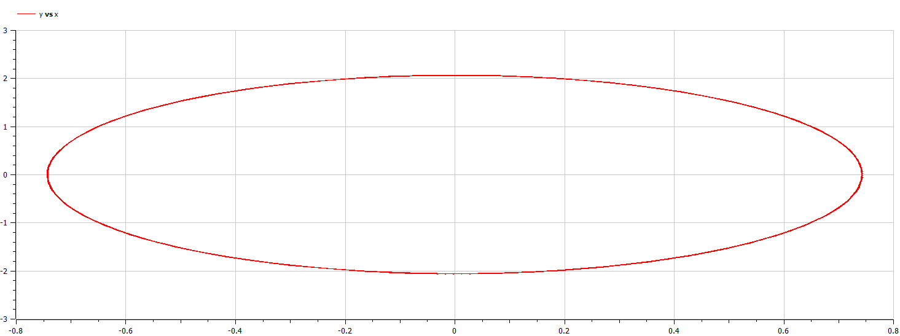{#fig:015}

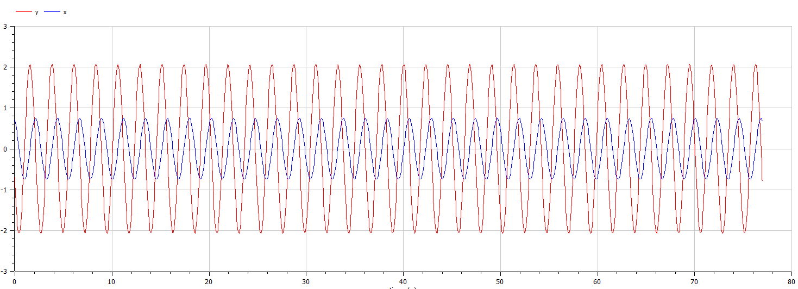{#fig:016}

Для второго случая (@fig:017 - @fig:018):

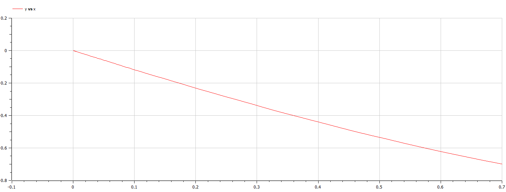{#fig:017}

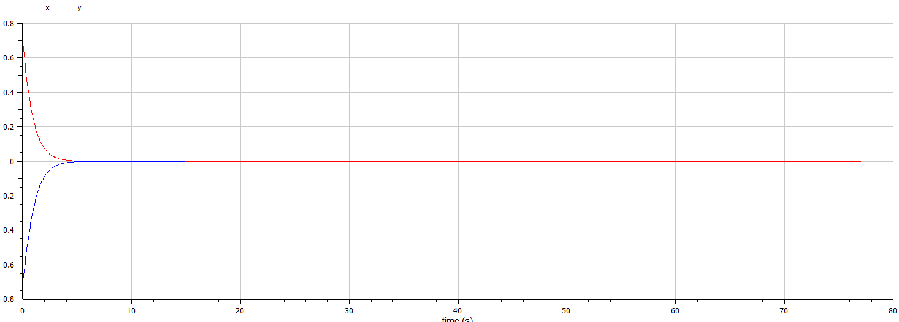{#fig:018}

Для третьего случая (@fig:019 - @fig:020):

{#fig:019}

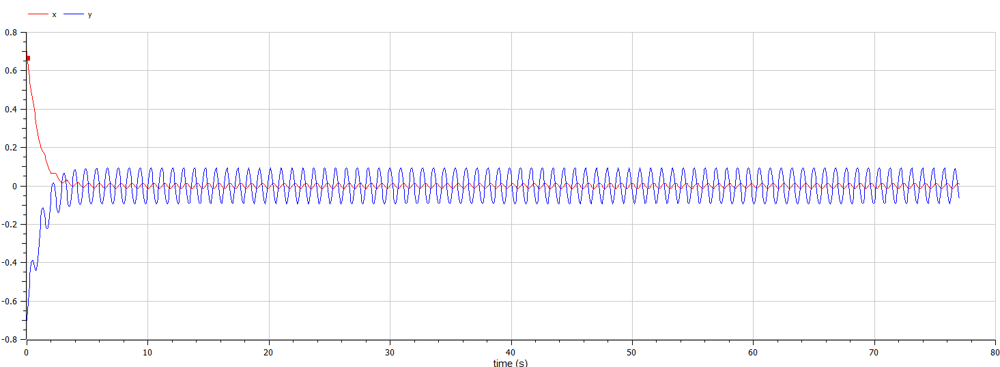{#fig:020}

# Вывод
В результате проделанной работы был написан код на Julia и OpenModelica для решения 3 случаев движения гармонического осциллятора.

# Список Литературы

[1] https://habr.com/ru/post/219337/

[2] https://ru.wikipedia.org/wiki/Гармонический_осциллятор
